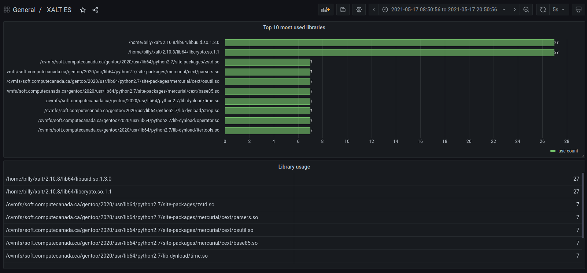

# ELK Stack

## Structure

`JSON` &rarr; `Filebeat` &rarr; `Logstash` &rarr; `ES` &larr; `Kibana`/`Grafana`

## JSON

* Enregistrés dans des dossiers sous `/var/log/xalt/`
* Les anciens fichiers JSON sont effacés avec logrotate ([config](../config/logrotate/xalt))

## Filebeat

[Fichier de configuration pour Filebeat](../config/filebeat/filebeat.yml)

## Logstash

### Liste des champs qui sont conservés
* libA (aplati) -> contient les bibliothèques utilisées par le programme
* userT -> contient des infos sur l'environnement dans lequel le programme a roulé
* cmdlineA -> contient tous les arguments qui ont été utilisés pour lancer le programme

[Fichier de configuration pour Logstash](../config/logstash/xalt.conf) \
[Filtre Ruby pour Logstash](../config/logstash/xalt_filter.rb)

## Elasticsearch
Aucune config. On popule les indexes avec Logstash et on va chercher les infos avec Kibana/Grafana.

## Kibana

