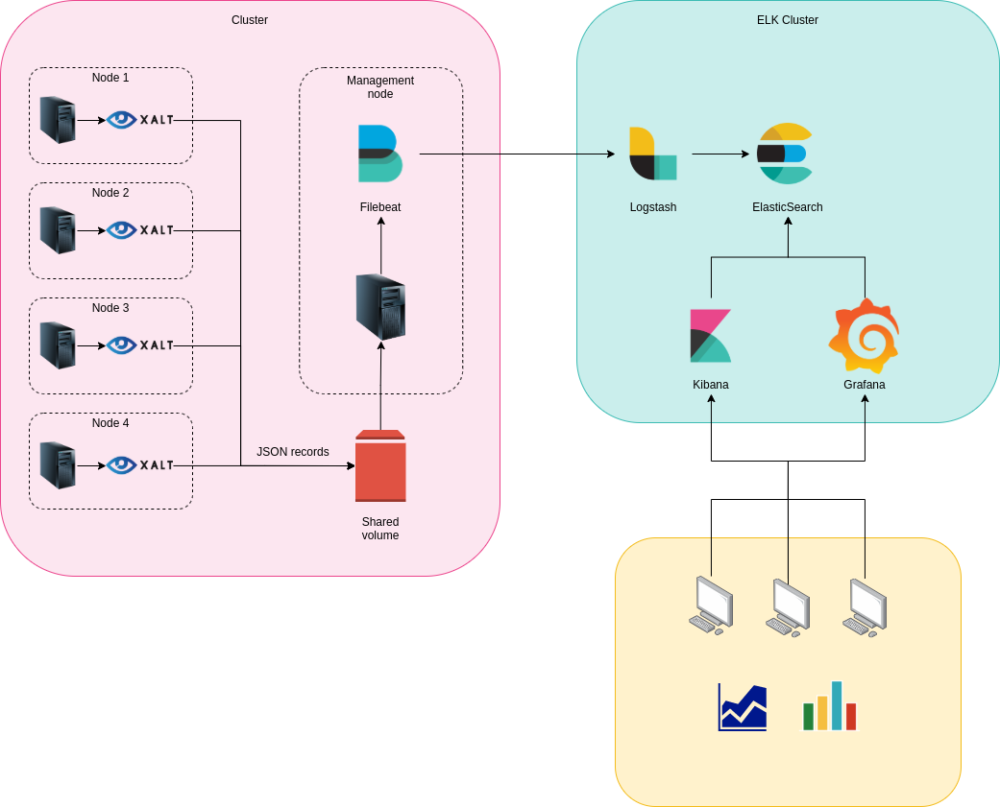
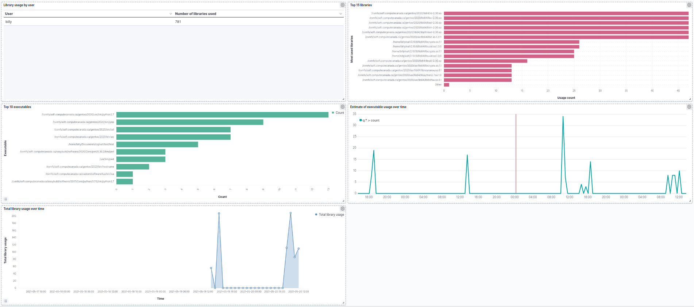

# XALT

## How XALT works

When XALT is used in the `LD_PRELOAD` mode only, the executables are not modified in any way. At run time, a dynamic executable will be linked against the `libxalt_init.so` library that is found in the `LD_PRELOAD` environment variable. The `libxalt_init.so` library adds code to the init and fini array to create the XALT records, which will be run before and after the executable.

If the path to the XALT `ld` wrapper is found before the real `ld` (or another `ld` wrapper) when building an executable, XALT will add a watermark with information on the build and will create a `link` record, containing information on which librairies were linked against the executable.

## Activate XALT tracking

There are several ways XALT can be activated. The simplest one is by using a module that sets the necessary environment variables when loaded, but the bare minimum for XALT to function are `XALT_EXECUTABLE_TRACKING` set to `yes` and the path `<XALT_DIR>/lib64/libxalt_init.so` in the `LD_PRELOAD` environment variable. Here are some examples of ways to activate XALT on an opt-in and opt-out basis.

### Opt-in

- Explicitly load the XALT module in job scripts.
- Add `xalt/<version>` to the `LMOD_SYSTEM_DEFAULT_MODULES` variable somewhere in the bash/csh profiles, but modify the module file so that `XALT_EXECUTABLE_TRACKING` is set to no by default. Users can then opt in by exporting `XALT_EXECUTABLE_TRACKING=yes` in their `.bashrc`.

### Opt-out
- Add `xalt/<version>` to the `LMOD_SYSTEM_DEFAULT_MODULES` variable somewhere in the bash/csh profiles. Users can then opt out by exporting `XALT_EXECUTABLE_TRACKING=no` in their `.bashrc`.

## ELK stack
### Filebeat

The role of Filebeat is to send the JSON records to the ELK cluster. The provided configuration file reads the JSON records from the directories located in `/var/log/xalt/` and sends them to a Logstash instance on an ELK cluster. You may also configure `logrotate` to delete old logs that were already ingested by Filebeat.

Note: The config file was written for Filebeat `5.6.16`. Newer versions of Filebeat may have a different structure and some options may have different names in newer versions of Filebeat. For example, `filebeat.prospectors` and `input_type` have been renamed to `filebeat.inputs` and `type` respectively.

### Logstash
The role of Logstash is to remove unnecessary values, parse the different fields and send the result to the ElasticSearch instances. The IP addresses and ports of the ElasticSearch instances need to be modified in the `output` part of the configuration file.

### Kibana and Grafana

Using Kibana or Grafana, you will be able to query the ElasticSearch indices and gather information on library and executable usage on your cluster.

## libuuid-devel

The libuuid-devel package is already installed in `StdEnv/2020`, but it may not be installed on the base system. If it is not present, programs from the base system that are tracked by XALT (e.g. `/bin/{tar,gzip,bzip2}`, see the [config](https://github.com/ComputeCanada/easybuild-easyconfigs/blob/computecanada-main/easybuild/easyconfigs/x/XALT/CC_config.py)) will not have a valid UUID. Since the record files produced by XALT are split over many directories based on UUID, every record with an invalid UUID will end up in the same directory.

## Cluster-specific installation

XALT provides many options that can be modified to fit your needs. Some, like which executables are tracked by XALT, can only be specified at build time, while others, like the location where record files are saved, can be changed with environment variables (`XALT_FILE_PREFIX` in this case).
To modify the configuration, you may need to rebuild XALT with your new config file. To do this, simply modify the CC_config.py file or the EasyBuild recipe and rebuild with

```
eb XALT-*.eb --inject-checksums --force
eb XALT-*.eb --installpath=<install_location>
```

## Default config

The EasyBuild recipe and the config file used to build the `xalt/.2.10.15` module can be found [here](https://github.com/ComputeCanada/easybuild-easyconfigs/tree/computecanada-main/easybuild/easyconfigs/x/XALT). For more information on what the different options do, see the [XALT documentation](https://xalt.readthedocs.io/en/latest/).

## Testing XALT

To test XALT, you can load the `xalt/.2.10.15` hidden module that has been deployed on `CVMFS`. To test the creation of record files, simply set the environment variable `XALT_SAMPLING` to `no`. You may also set `XALT_TRACING` to `link` or `yes` to debug XALT.

## Examples
Examples on how to use XALT can be found in the `examples/` directory.
### Structure:


### Kibana dashboard:

